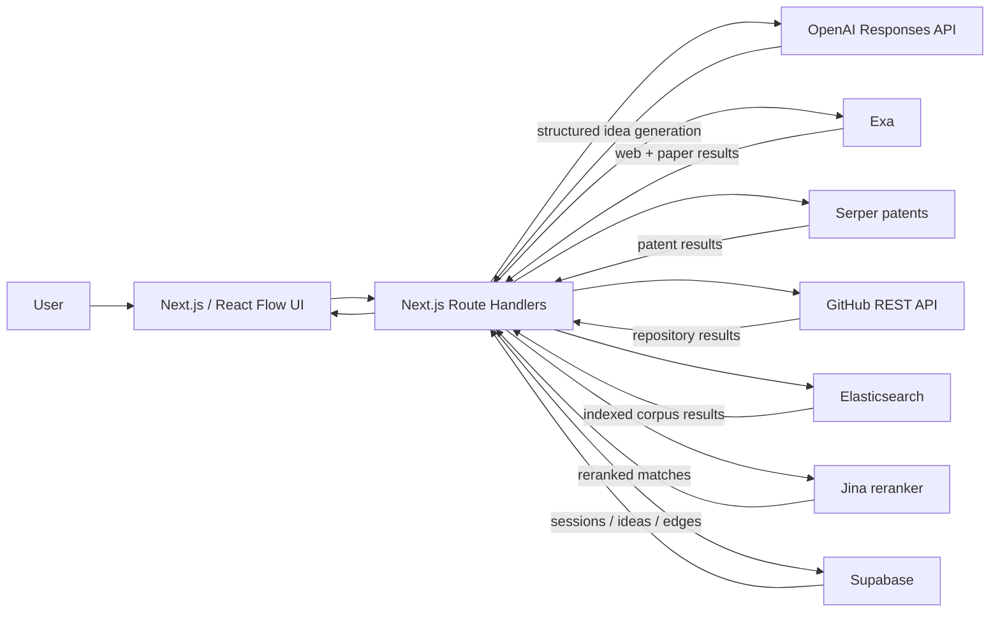
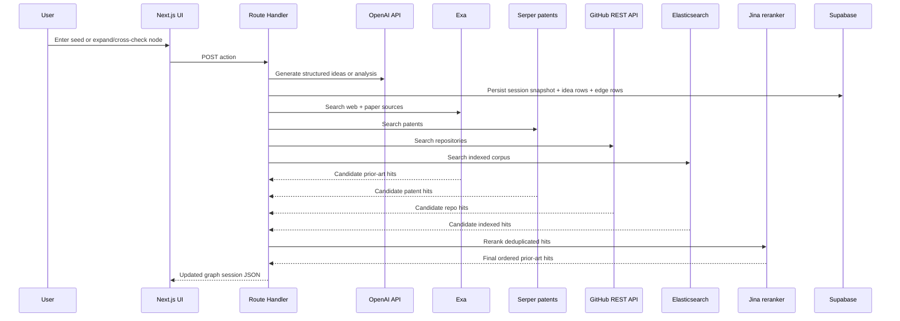

# Synaptic Architecture

## Diagram

The checked-in `architecture.svg` predates the current cross-check pipeline. Use the Mermaid diagrams below as the source of truth.

## Source Diagram

## Request lifecycle

## Stack

- Frontend: Next.js 16, React 19, React Flow, Tailwind CSS
- AI generation: OpenAI Responses API with structured JSON outputs
- Search: Exa, Serper patents, GitHub REST API, optional Elasticsearch, Jina reranker
- Persistence: Supabase tables for sessions, ideas, and idea edges

## Data model

- `sessions`
  - canonical session snapshot
  - graph JSON
  - insights JSON
  - one-pager JSON
- `ideas`
  - one row per node
  - parent-child relationship via `parent_id`
  - detailed idea dossier in JSON
  - prior-art results and cross-check metadata
- `idea_edges`
  - relationship labels and explanations for graph rendering

## Process responsibilities

- OpenAI
  - generate initial idea branches
  - generate child branches on expansion
  - generate critiques / tensions
  - generate one-pager

- External search
  - search web and paper sources via Exa
  - search patents via Serper
  - search repositories via GitHub
  - search an optional indexed corpus via Elasticsearch
  - rerank combined results via Jina

- Supabase
  - primary source of truth for sessions
  - normalized storage for ideas and edges
  - backing store for resumable/shareable sessions
