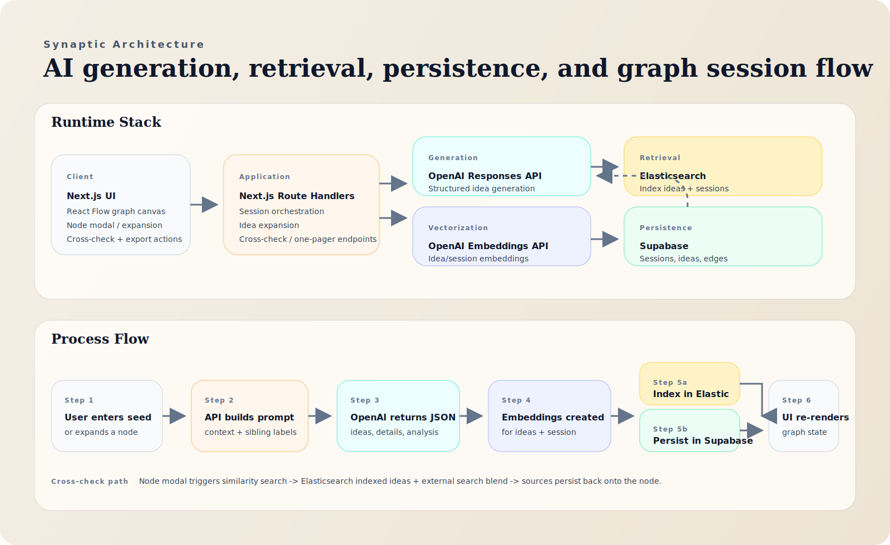
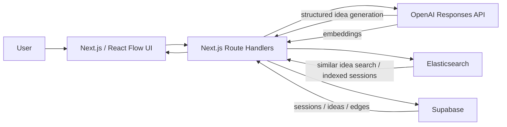
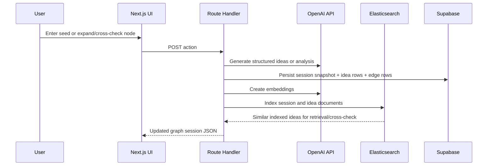

# Synaptic Architecture

## Diagram

## Source Diagram

## Request lifecycle

## Stack

- Frontend: Next.js 16, React 19, React Flow, Tailwind CSS
- AI generation: OpenAI Responses API with structured JSON outputs
- Embeddings: OpenAI embeddings API
- Search/indexing: Elasticsearch dense vector + semantic search
- Persistence: Supabase tables for sessions, ideas, and idea edges

## Data model

- `sessions`
  - canonical session snapshot
  - graph JSON
  - insights JSON
  - one-pager JSON
- `ideas`
  - one row per node
  - parent-child relationship via `parent_id`
  - detailed idea dossier in JSON
  - prior-art results and cross-check metadata
- `idea_edges`
  - relationship labels and explanations for graph rendering

## Process responsibilities

- OpenAI
  - generate initial idea branches
  - generate child branches on expansion
  - generate critiques / tensions
  - generate one-pager
  - generate embeddings for semantic indexing

- Elasticsearch
  - index sessions for retrieval
  - index individual ideas for similarity search
  - return nearest prior internal ideas during cross-check

- Supabase
  - primary source of truth for sessions
  - normalized storage for ideas and edges
  - backing store for resumable/shareable sessions
